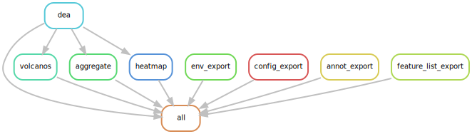
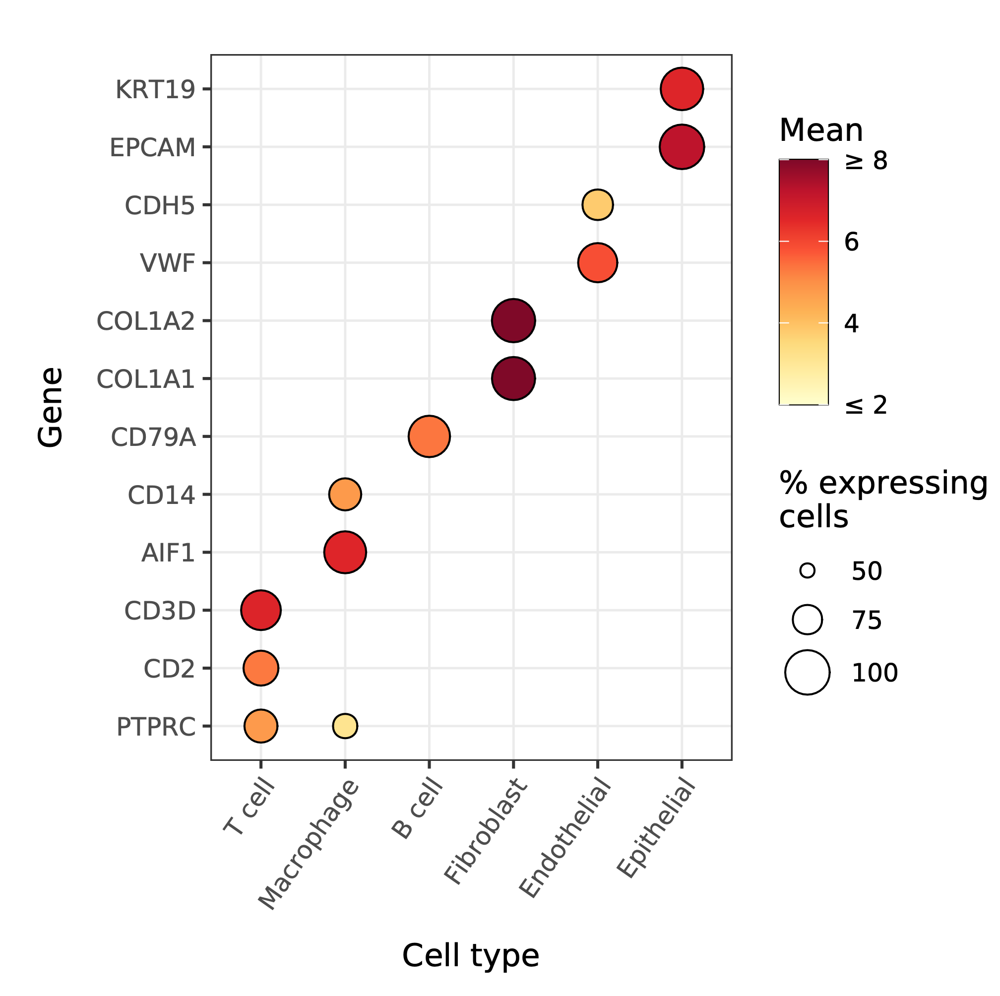
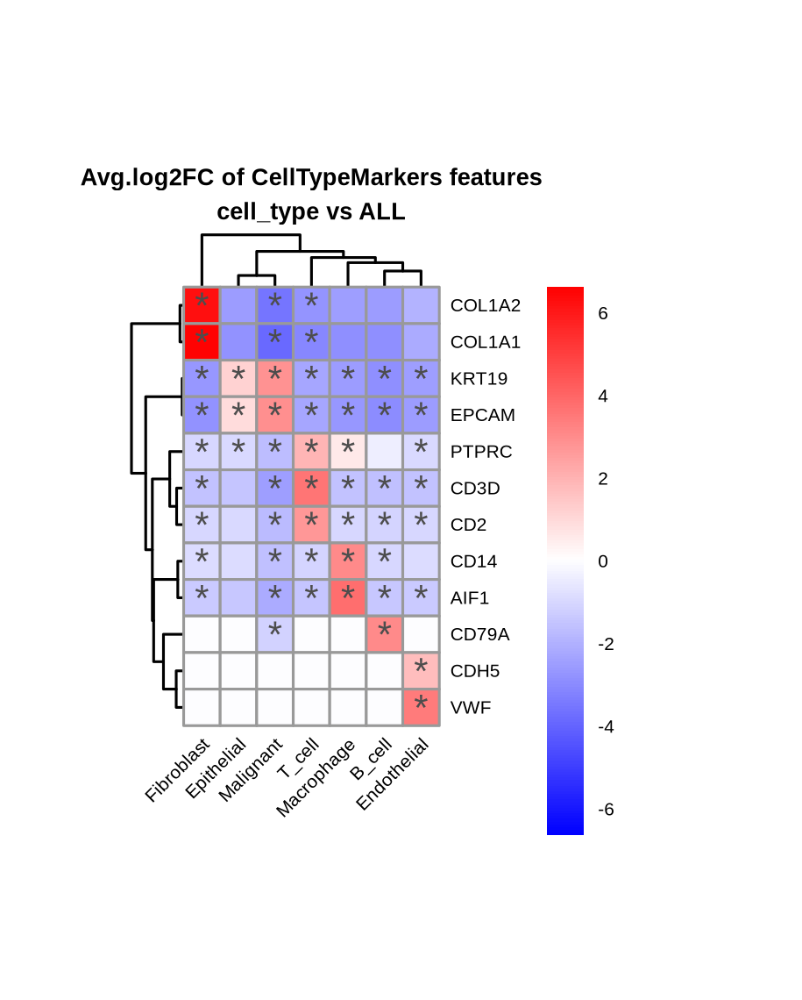

[](https://github.com/epigen/MrBiomics/)
[](https://zenodo.org/doi/10.5281/zenodo.10689139)
[]() 
[]()
[](https://github.com/epigen/dea_seurat/blob/master/LICENSE)

[](https://snakemake.readthedocs.io/en/stable/)

# Single-cell RNA sequencing (scRNA-seq) Differential Expression Analysis & Visualization Workflow
A [Snakemake 8](https://snakemake.readthedocs.io/en/stable/) workflow for performing differential expression analyses (DEA) of processed (multimodal) scRNA-seq data powered by the R package [Seurat's](https://satijalab.org/seurat/index.html) functions [FindMarkers](https://satijalab.org/seurat/reference/findmarkers) and [FindAllMarkers](https://satijalab.org/seurat/reference/findallmarkers).

> [!NOTE]  
> This workflow adheres to the module specifications of [MrBiomics](https://github.com/epigen/MrBiomics), an effort to augment research by modularizing (biomedical) data science. For more details, instructions, and modules check out the project's repository.
>
> ⭐️ **Star and share modules you find valuable** 📤 - help others discover them, and guide our future work!

> [!IMPORTANT]  
> **If you use this workflow in a publication, please don't forget to give credit to the authors by citing it using this DOI [10.5281/zenodo.10689139](https://zenodo.org/doi/10.5281/zenodo.10689139).**



# 🖋️ Authors
- [Stephan Reichl](https://github.com/sreichl)
- [Christoph Bock](https://github.com/chrbock)

# 💿 Software
This project wouldn't be possible without the following software and their dependencies:

| Software       | Reference (DOI)                                   |
| :------------: | :-----------------------------------------------: |
| data.table     | https://r-datatable.com                           |
| EnhancedVolcano| https://doi.org/10.18129/B9.bioc.EnhancedVolcano  |
| future         | https://doi.org/10.32614/RJ-2021-048              |
| ggplot2        | https://ggplot2.tidyverse.org/                    |
| pheatmap       | https://cran.r-project.org/package=pheatmap       |
| Seurat         | https://doi.org/10.1016/j.cell.2021.04.048        |
| Snakemake      | https://doi.org/10.12688/f1000research.29032.2    |

# 🔬 Methods
This is a template for the Methods section of a scientific publication and is intended to serve as a starting point. Only retain paragraphs relevant to your analysis. References [ref] to the respective publications are curated in the software table above. Versions (ver) have to be read out from the respective conda environment specifications (`workflow/envs/*.yaml file`) or post-execution in the result directory (`dea_seurat/envs/*.yaml`). Parameters that have to be adapted depending on the data or workflow configurations are denoted in squared brackets e.g., [X].

The outlined analyses were performed using the R package Seurat (ver) [ref] unless stated otherwise.

**Differential Expression Analysis (DEA).** DEA was performed on the assay [X] and data slot [X] with Seurat's [FindMarkers|FindAllMarkers] function using the statistical test [X] with the parameters log2(fold change) threshold of [X] and minimal percentage of expression [X]. The results were filtered for relevant features by adjusted p-value of [X], absolute log2(fold change) of [X] and minimum percentage of expression [X].

**Visualization.** All filtered result statistics, i.e., number of statistically significant results split by positive (up) and negative (down) effect-sizes, were separately visualized with stacked bar plots using ggplot (ver) [ref]. 
To visually summarize results of the same analysis the filtered log2(fold change) values of features that were found to be at least in one comparison statistically significantly differentially expressed were visualized in a hierarchically clustered heatmap using pheatmap (ver) [ref]. 
Volcano plots were generated for each analysis using EnhancedVolcano (ver) [ref] with adjusted p-value threshold of [X] and log2(fold change) threshold of [X] as visual cut-offs for the y- and x-axis, respectively.

**The analysis and visualizations described here were performed using a publicly available Snakemake [ver] (ref) workflow [[10.5281/zenodo.10689139](https://zenodo.org/doi/10.5281/zenodo.10689139)].**

# 🚀 Features
The workflow performs the following steps to produce the outlined results (`dea_seurat/{analysis}/`).
- Differential Expression Analysis (DEA)
  - using Seurat's [FindMarkers](https://satijalab.org/seurat/reference/findmarkers) or [FindAllMarkers](https://satijalab.org/seurat/reference/findallmarkers) depending on the configuration (`results.csv`). This step is parallelized using the R package `future`.
  - feature list per comparison group and direction (up/down) for downstream analysis (e.g., enrichment analysis) (`feature_lists/{group}_{up/down}_features.txt`)
  - (optional) feature score tables (with two columns: "feature" and "score") per comparison group using `{score_formula}` for downstream analyses (e.g., preranked enrichment analysis) (`feature_lists/{group}_featureScores.csv`).
  - results filtered according to the configured thresholds:
    - statistical significance (adjusted p-value).
    - effect-size (log2 fold change).
    - expression (minimum percentage of expression) in one of the comparison groups.
  - filtered result statistics: number of statistically significant results split by positive (up) and negative (down) change (`stats.csv`).
- Visualizations (`dea_seurat/{analysis}/plots`)
  - filtered result statistics: number of features and direction as bar plot (`stats.png`).
  - volanco plots per comparison group with effect size on the x-axis and raw p-value(`*_rawp`)/adjusted p-value (`_adjp`) on the y-axis (`volcano/{feature_list}/{group}.png`).
      - highlighting features according to configured cut-offs for statistical significance (`pCutoff`) and effect size (`FCcutoff`).
      - (optional) highlighting features according to configured feature lists.
  - hierarchically clustered heatmap of effect sizes (LFC) per comparison (features x comparisons) indicating statistical significance with a star '\*' (`heatmap/{feature_list}.png`).
      - using all filtered features (FILTERED)
      - (optional) using configured feature lists
      - in case of more than 100 features the row labels and significance indicators (\*) are removed

# 🛠️ Usage
Here are some tips for the usage of this workflow:
- Perform your first run with loose filtering options/cut-offs and set the same for filtering and plotting to see if further filtering is even necessar or useful.
- Try one small/simple analysis first before running all desired analyses.

# ⚙️ Configuration
Detailed specifications can be found here [./config/README.md](./config/README.md)

# 📖 Examples
We selected a scRNA-seq data set consisting of 15 CRC samples from [Lee et al (2020) Lineage-dependent gene expression programs influence the immune landscape of colorectal cancer. Nature Genetics](https://doi.org/10.1038/s41588-020-0636-z). Downloaded from the [Weizmann Institute - Curated Cancer Cell Atlas (3CA) - Colorectal Cancer](https://www.weizmann.ac.il/sites/3CA/colorectal) section.
- samples/patients: 15
- cells: 21657
- features (genes): 22276
- preprocessed using the compatible MrBiomics module for [scRNA-seq data processing & visualization](https://github.com/epigen/scrnaseq_processing_seurat)
- We performed a 1 vs rest analysis using the cell type annotation ("ALL").
- total runtime on HPC w/ SLURM (32GB RAM; only DEA with 8 cores otherwise 1 core): <25 minutes for 17 jobs in total

A comparison of the cell type marker expression split by cell types visualized as a dot plot with the DEA results as hierarchically clustered heatmap of the effect sizes.

[data source/authors](https://www.weizmann.ac.il/sites/3CA/study-data/cell-types/20086)             |  Workflow Output
:-------------------------:|:-------------------------:
  |  

We provide metadata, annotation and configuration files for this data set in ./test. The processed and prepared [Seurat RDS object](https://doi.org/10.5281/zenodo.10688824) has to be downloaded from Zenodo by following the instructions below.
  ```console
  # download Zenodo records using zenodo_get

  # install zenodo_get v1.3.4
  conda install -c conda-forge zenodo_get=1.3.4

  # download the prepare Seurat RDS object
  zenodo_get --record 10688824 --output-dir=test/data/Lee2020NatGenet/
  ```

# 🔗 Links
- [GitHub Repository](https://github.com/epigen/dea_seurat/)
- [GitHub Page](https://epigen.github.io/dea_seurat/)
- [Zenodo Repository](https://zenodo.org/doi/10.5281/zenodo.10689139)
- [Snakemake Workflow Catalog Entry](https://snakemake.github.io/snakemake-workflow-catalog?usage=epigen/dea_seurat)

# 📚 Resources
- Recommended compatible [MrBiomics](https://github.com/epigen/MrBiomics) modules for:
  - upstream analysis
    - [scRNA-seq Data Processing & Visualization](https://github.com/epigen/scrnaseq_processing_seurat) for processing (multimodal) single-cell transcriptome data.
  - downstream analyses
    - [Unsupervised Analysis](https://github.com/epigen/unsupervised_analysis) to understand and visualize similarities and variations between cells/samples, including dimensionality reduction and cluster analysis. Useful for all tabular data including single-cell and bulk sequencing data.
  - [Enrichment Analysis](https://github.com/epigen/enrichment_analysis) for biomedical interpretation of (differential) analysis results using prior knowledge.

# 📑 Publications
The following publications successfully used this module for their analyses.
- [FirstAuthors et al. (202X) Journal Name - Paper Title.](https://doi.org/10.XXX/XXXX)
- ...

# ⭐ Star History

[](https://star-history.com/#epigen/dea_seurat&Date)
